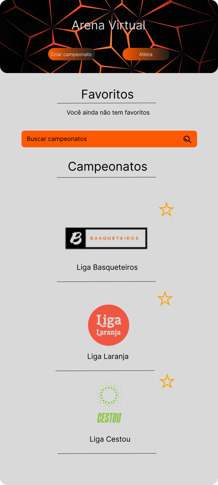

# 🏀 Arena Virtual

Bem-vindo ao **Arena Virtual**! Este é um projeto de TCC do curso de Ciência da Computação, desenvolvido com o objetivo de criar um **gerenciador de campeonatos amadores de basquete** utilizando **C# .NET MAUI**. 🎓

## 📋 Sobre o Projeto

O **Arena Virtual** é uma aplicação multiplataforma que permite:
- 📅 **Gerenciar campeonatos**: Criação, edição e exclusão de torneios.
- 🏆 **Acompanhar partidas**: Registro de resultados e estatísticas.
- 👥 **Gerenciar equipes**: Cadastro de times e jogadores.
- 📊 **Visualizar rankings**: Classificação dos times em tempo real.

A aplicação foi projetada para funcionar em **Android**, **iOS**, **Windows** e **MacCatalyst**, aproveitando o poder do .NET MAUI para criar uma experiência unificada.

## 🚀 Tecnologias Utilizadas

- **C# .NET MAUI**: Framework para desenvolvimento multiplataforma.
- **SQLite**: Banco de dados local para armazenamento de informações.
- **MVVM**: Arquitetura para separação de responsabilidades.
- **XAML**: Para criação de interfaces gráficas.

## 📱 Capturas de Tela

### Tela Inicial

### Gerenciamento de Campeonatos

