# 🏀 Arena Virtual

Bem-vindo ao **Arena Virtual**! Este é um projeto de TCC do curso de Ciência da Computação, desenvolvido com o objetivo de criar um **gerenciador de campeonatos amadores de basquete** utilizando **C# .NET MAUI**. 🎓

## 📋 Sobre o Projeto

O **Arena Virtual** é uma aplicação multiplataforma que permite:
- 🏆 **Gerenciamento de Campeonatos:** Criação, edição e exclusão de torneios.
- 📊 **Acompanhamento de Partidas:** Registro de resultados, estatísticas e histórico de jogos.
- ⛹️‍ **Gestão de Equipes:** Cadastro de times e jogadores, edição e exclusão.
- 📈 **Ranking em Tempo Real:** Visualização da classificação dos times.
- 📱💻 **Interface Multiplataforma:** Experiência unificada em Android, iOS, Windows e MacCatalyst.
- 🌐 **API REST:** Permite integração com sistemas externos, sincronização de dados e acesso remoto às informações do campeonato.

A aplicação foi projetada para funcionar em **Android**, **iOS**, **Windows** e **MacCatalyst**, aproveitando o poder do .NET MAUI para criar uma experiência unificada.

## 🚀 Tecnologias Utilizadas

- 👨‍💻 **C#**: Linguagem de programção
- ⚙️ **.NET MAUI**: Framework para desenvolvimento multiplataforma.
- 🗄️ **SQLite**: Banco de dados local para armazenamento de informações.
- 🏗️ **MVVM**: Arquitetura para separação de responsabilidades.
- 🎨 **XAML**: Para criação de interfaces gráficas.
- 🌐 **API REST:** ASP.NET Core Web API (para integração e sincronização de dados)
- 🛠️ **Ferramentas:** Visual Studio 2022, .NET 8 SDK, swagger (para documentação e testes de API)

## 📱 Screenshots (Telas do Aplicativo)

Para demonstrar a experiência do usuário e as funcionalidades do Arena Virtual, apresentamos algumas telas-chave da aplicação.

* **Tela de Abertura (Splash Screen):** 

    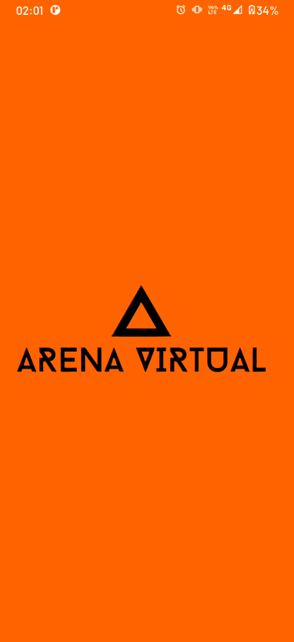

    
> **Destaque:** Demonstra a identidade visual durante o carregamento (Assumindo que esta imagem existe, embora não tenha sido enviada).

* **Tela de Login:**

    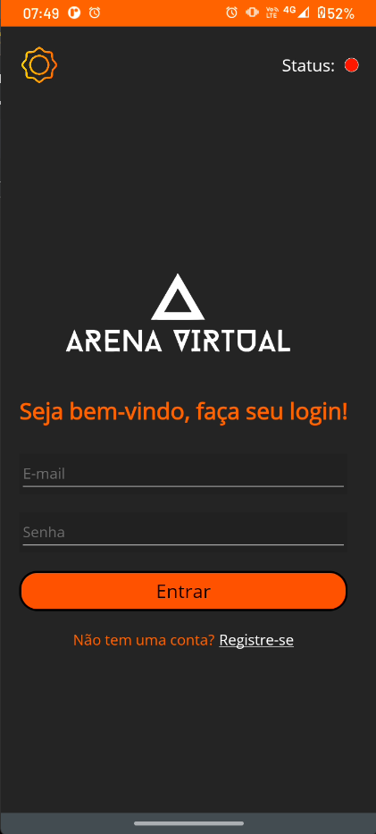
    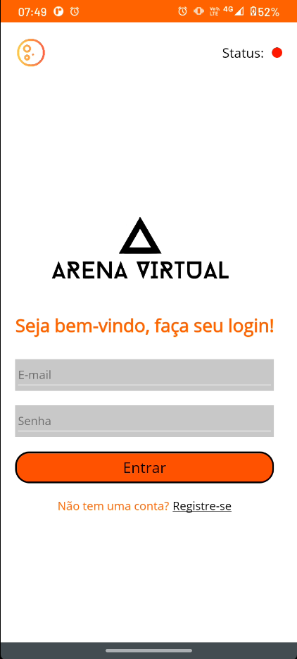

> **Destaque:** Demonstração da interface de login em temas **Escuro** e **Claro**, evidenciando a adaptabilidade visual do .NET MAUI.

* **Tela de Registro de Usuário (Cadastro):**

    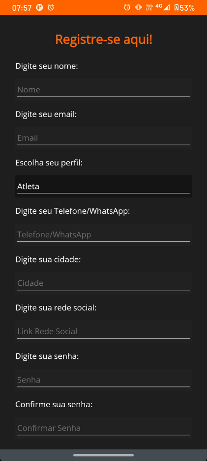
    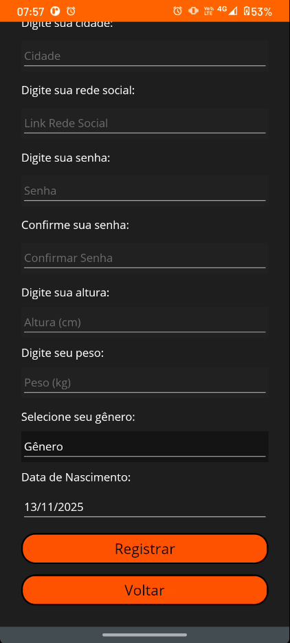

    
> **Destaque:** Duas partes do formulário de registro, mostrando a coleta de dados básicos (nome, email) e dados específicos do atleta (altura, peso).

* **Tela Inicial:**

    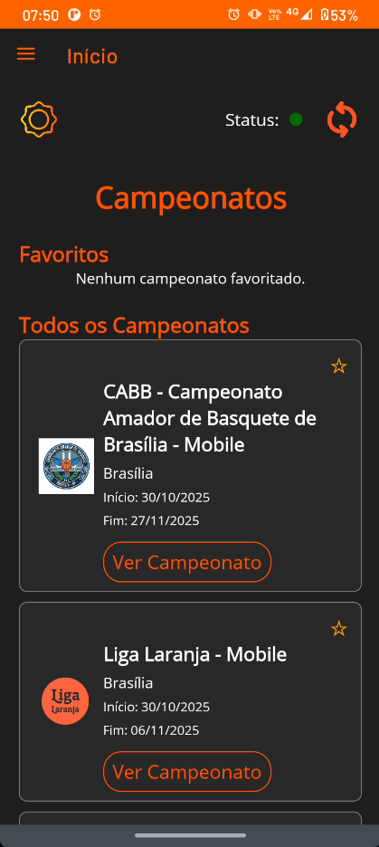
    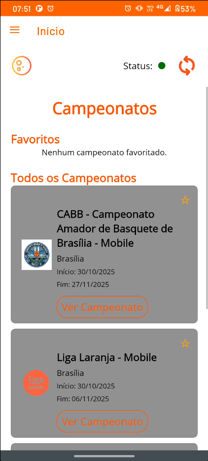

> **Destaque:** Visão geral rápida dos campeonatos ativos (Favoritos e Todos), facilitando a navegação e o acompanhamento dos torneios.

* **Classificação e Jogos do Campeonato:**

    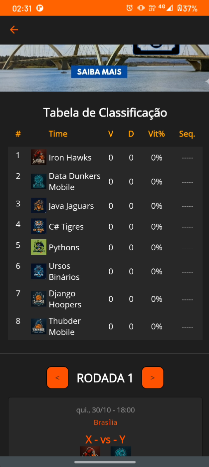
    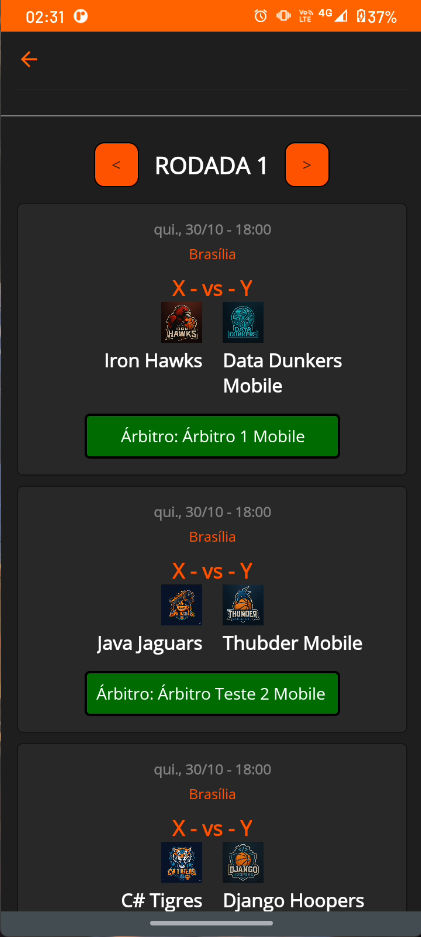

    
> **Destaque:** Apresentação dinâmica do ranking (Tabela de Classificação) e a listagem dos jogos da rodada, as funcionalidades centrais do gerenciador.

* **Estatísticas do Campeonato e dos Jogadores:**

    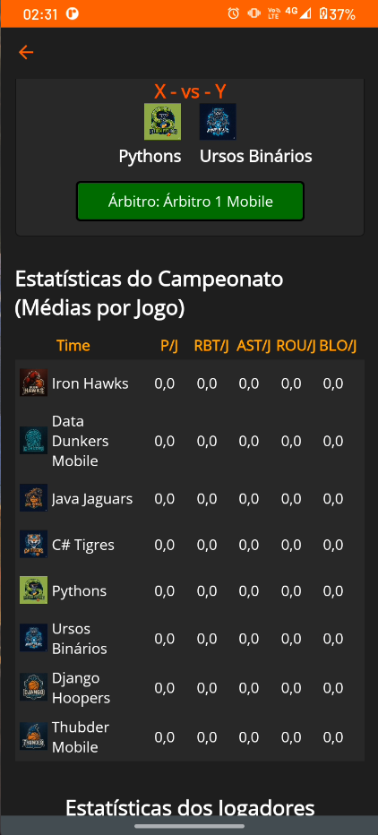
    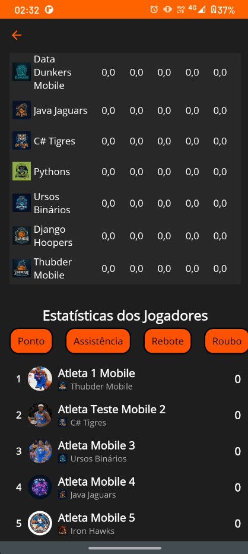

    
> **Destaque:** Detalhes estatísticos cruciais (médias por jogo) e o ranking individual de jogadores por categoria (Ponto, Assistência, Rebote, Roubo), evidenciando a capacidade de acompanhamento.

* **Gestão de Fases (Opcional, para demonstrar o controle do Admin):** 

    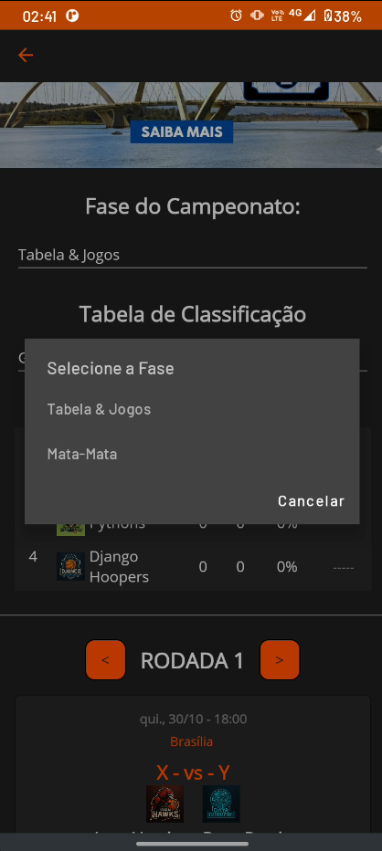

        
> **Destaque:** Demonstração da flexibilidade do sistema em lidar com diferentes fases do campeonato (Tabela & Jogos, Mata-Mata).

---

## Como Iniciar o Projeto

### Pré-requisitos

- [.NET 8 SDK](https://dotnet.microsoft.com/download)
- Visual Studio 2022 (com suporte ao .NET MAUI)
- Emulador Android/iOS ou ambiente Windows/MacCatalyst

### Passos

1. **Clonar o repositório:**
`git clone https://github.com/RaphaelLins6/ArenaVirtual-TCC.git`

2. **Acessar a pasta do projeto:**
`cd ArenaVirtual-TCC`

3. **Restaurar dependências:**
- Abra o projeto no Visual Studio 2022
- Execute o comando __Build > Restore NuGet Packages__ ou pressione `Ctrl+Shift+B`

4. **Configurar variáveis de ambiente (se necessário):**
- O projeto utiliza SQLite local, não requer configuração adicional para ambiente de desenvolvimento.
- Para a API, configure o arquivo `appsettings.json` conforme necessário (porta, string de conexão, etc).

5. **Executar o projeto:**
- Selecione a plataforma desejada (Android, iOS, Windows, MacCatalyst) e pressione `F5` para iniciar o app.
- Para iniciar a API, selecione o projeto da Web API e pressione `F5` ou execute:
  `dotnet run --project ArenaVirtual.Api`

---

## 📜 Licença

Este projeto está licenciado sob a licença MIT. Veja o arquivo [LICENSE](LICENSE) para mais detalhes.

## Autor

- Raphael Lins – [GitHub](https://github.com/RaphaelLins6)

## 🙏 Agradecimentos

Agradecimentos especiais à minha família, ao meu orientador, colegas de curso e à comunidade .NET MAUI pelo suporte e recursos disponibilizados.

---
